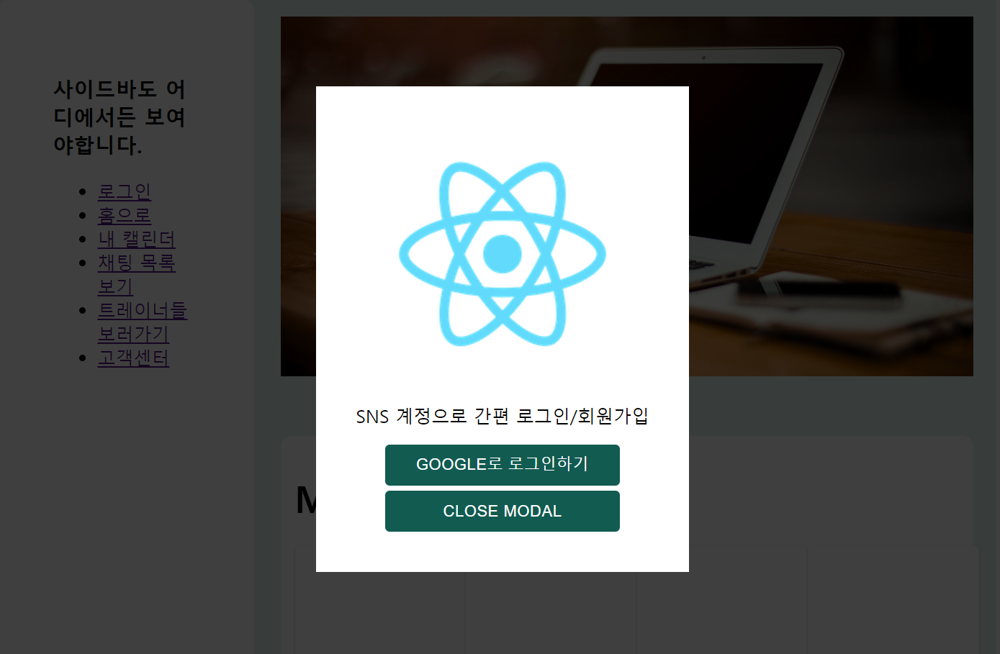
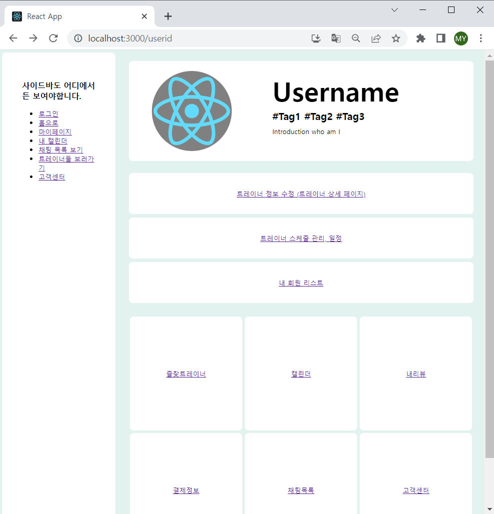

# [tcha] FE_YMY (230725)

## Today's Task

  ### 1. 아침 코드리뷰
  - React.FC 이슈 스터디 
  - Auth 페이지 코드 개선 필요 

  ### 2. Auth 페이지 레이아웃 진행 
  - 로고삽입
  - Google로 로그인 연동 버튼
  - 취소 버튼
 
  ### 3. Profile 페이지 레이아웃 진행 
  - 전반적인 레이아웃 코드 작성 

  
  

## 회의록
  - Merge Conflict 이슈
    - Module/설치 관련
      - 설치 시 공유
    - Redux 관련
      - State 관련 수정시 오후/밤 작업 후 공유

  

## TIL 
### React.FC 사용을 지양해야 하는 이유 
- [React.FC 관련 참고문서 1](https://emewjin.github.io/why-not-fc/)
- [React.FC 관련 참고문서 2](https://story.pxd.co.kr/1650)

  

  ## FE 진행상황  

### Login Modal  
- Layout Develop (95%)
    
### Profile Page 
- Basic Layout (100%)
    

    
  