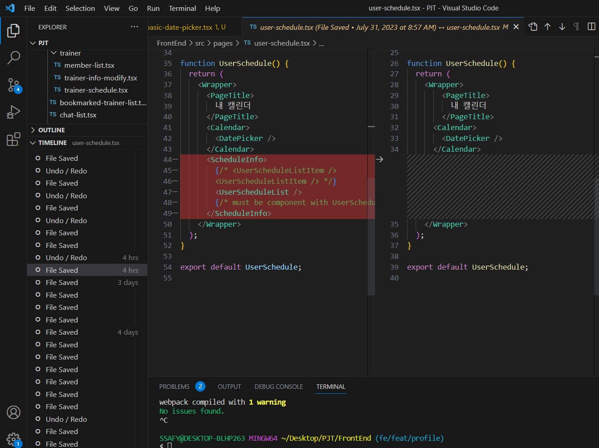
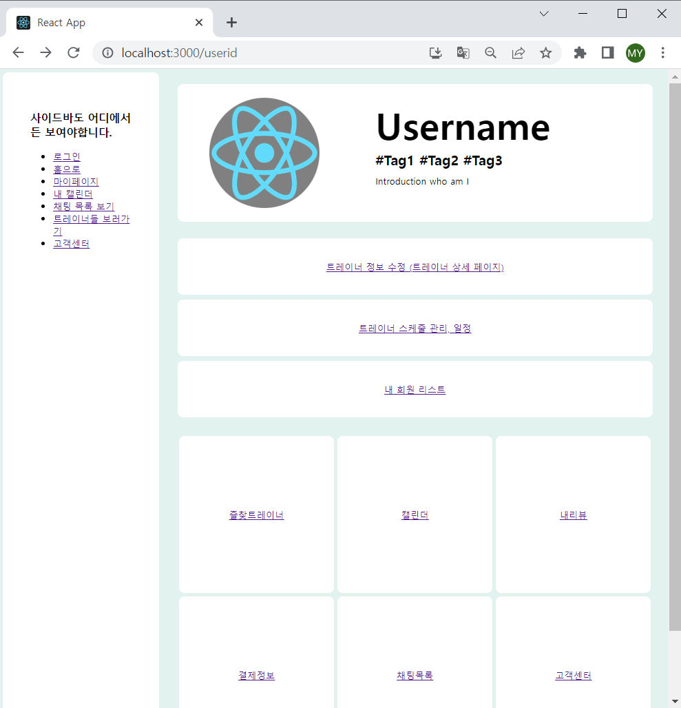

# [tcha] FE_YMY (230731)

## Today's Task

  ### 1. 아침 코드리뷰
  - [Redux Toolkit 스터디](https://nomadcoders.co/redux-for-beginners/lectures/1626)
  - Auth 페이지 코드 개선 필요 
    - Modal 이중 적용된 코드 발견 -> 해결 

  ### 2. Git commit / merge request ISSUE
  - 커밋 시 전체 .add가 안 된 상태로 일부만 커밋 후 merge, pull
  - 복구 작업
    - VS CODE IDE 자체 TIMELINE 기능 발견
      - [Local History](https://code.visualstudio.com/updates/v1_66#_local-history) 
       
 
  ### 3. Schedule 페이지 레이아웃 진행 
  - 레이아웃 완성도 진척 (85%)
  - API 연결 (Dummy Data) 기반 마련 
    

  
  

## 회의록
  - Routing / 폴더 구조 수정 
    - 공유 data -> Shared에 저장
      - 버튼, 모달, 재사용 가능 요소 등등
  - Redux 관련
    - UseAxios 커스텀 훅 생성 시도 

  

## TIL 
### Git 복구 관련 
- [삭제한 커밋 혹은 브랜치 복구하기 ](https://hsik0225.github.io/git/2021/11/25/Git-%EC%82%AD%EC%A0%9C%ED%95%9C-%EC%BB%A4%EB%B0%8B-%ED%98%B9%EC%9D%80-%EB%B8%8C%EB%9E%9C%EC%B9%98-%EB%B3%B5%EA%B5%AC%ED%95%98%EA%B8%B0/)

  

  ## FE 진행상황  

### Schedule Page
- API, Axios, Dummy Data (65%)
    
### Profile Page 
- Routing (100%)
    

    
  