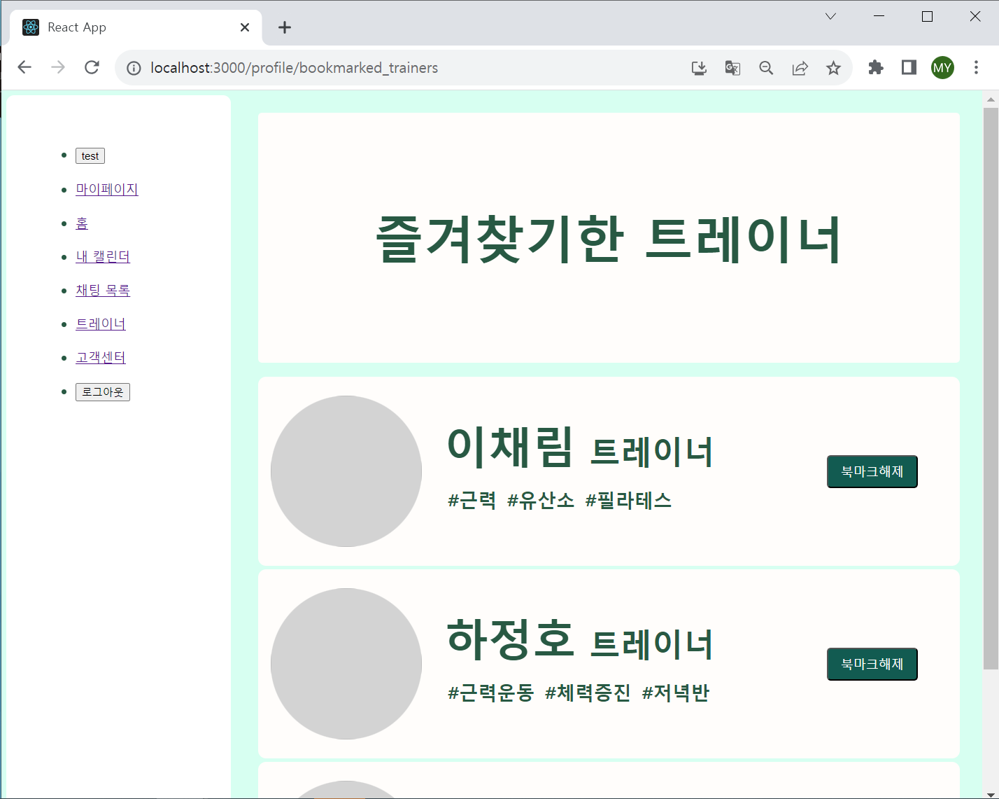
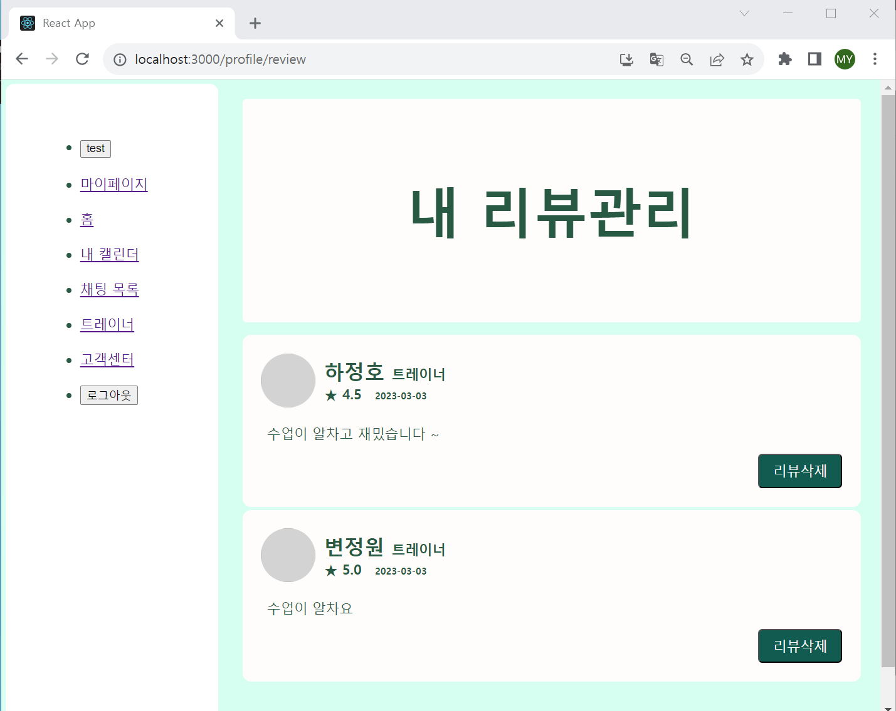
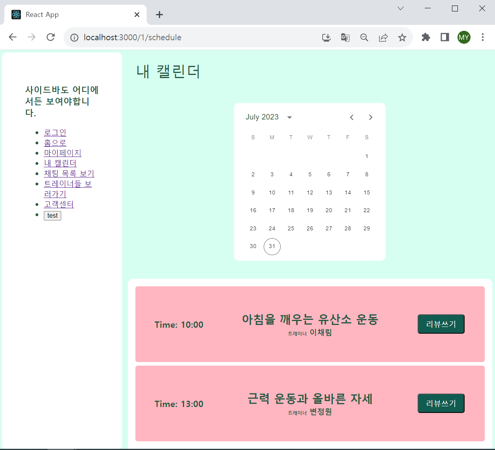

# [tcha] FE_YMY (230801)

## Today's Task

  ### 1. 아침 코드리뷰
  - [Redux Toolkit 스터디](https://nomadcoders.co/redux-for-beginners/lectures/1626)
  - CSS 관련 재사용 코드 정비
    - PageTitle Component 등 
 
 
  ### 2. Profile 하위 페이지 작업 진행 
  - 레거시버전 레이아웃 완성
    - 즐겨찾기 페이지
    - 내 리뷰 모음 페이지  
  - API 연결 (Dummy Data) 기반 마련 

  
  

## 회의록
  - BE 소통
    - IntelliJ 서버 실행법 공유받음
    - MySQL Workbench 설치 및 DB확인
  - DB 더미데이터 생성 필요 (FE담당)
    - 로직 구현 및 API 연결 작동 확인용
    - 유저, 트레이너 가상 계정 생성  

  

## TIL 
### DB, API 관련 
- [AWS RDS MariaDB 한글 깨짐 현상](https://soobarkbar.tistory.com/222)
- [HTTP Content-Type](https://soobarkbar.tistory.com/222)
- [서버관련 - AWS RDS Too many Connections 현상](https://sum-mit45.tistory.com/24)
  

## FE 진행상황  

### Bookmarked-Trainer Page 
- Legacy ver Layout (100%)
-  API, Axios, Dummy Data (30%)
    

### UserReviewList Page
- Legacy ver Layout (100%)
-  API, Axios, Dummy Data (30%)
    

### Schedule Page
- Legacy ver Layout (100%)
-  API, Axios, Dummy Data (30%)
    

    
  