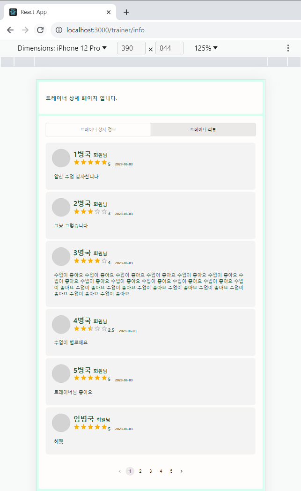

# [tcha] FE_YMY (230803)

## Today's Task

  ### 1. 아침 코드리뷰
  - Page/Component Hierarchy 관련 Feedback 수렴 
  - Page - Component - Component item 
    - 일부 페이지에서 지나친 계층화로 컴포넌트 수 증가, 낭비 발생된다고 판단
    - 단계를 줄여 반드시 필요한 것만 계층화하고 가독성 / 개발 접근성 높일 필요성
 
 
  ### 2. Trainer 페이지 작업 진행 
  - 레거시버전 레이아웃 완성
    - 트레이너 PT정보 페이지 *-> (100%)*
    - 트레이너 리뷰모음 페이지 *-> (95%)*
    - 트레이너 회원관리 페이지 *-> (0%)*
    - 트레이너 스케줄 페이지  *-> (0%)*
  - API 연결 (Dummy Data) 기반 마련 

  
  

## 회의록
  - **FE**
    - Axios로 받아오는 데이터 type issue
    - React Theme 시스템 구축, Typography 및 Color 설정 통일 필요 
    - 트레이너 Detail 페이지 구현 방식 논의
      - Review Page
        - 리뷰 별점 구현-> int로 받아서 별점 렌더
          - [mui star](https://mui.com/material-ui/react-rating/)
        - 한 페이지당 기본적으로 5개의 리뷰 렌더
        - Pagenation을 통해 다음 개수도 렌더 
          - [mui pagenation](https://mui.com/material-ui/react-pagination/)
      - multi console.log issue
        - 페이지 렌더 시 axios 요청으로 불러오는 데이터가 4번 출력됨
          - 두 번은 REACT Strict Mode로 발생
            - [REACT STRICT MODE란?](https://ko.legacy.reactjs.org/docs/strict-mode.html)
          - 왜 x2인지? 
            - axios multi request로 인해 console.log가 여러번 실행됨 
  
  - **BE 소통**
    - (트레이너) PT 생성 (시간별) 페이지 구현방식 회의 
      - Timeline식으로 시각적으로도 스케쥴링을 실시간으로 볼 수 있었으면 좋겠음
      - 30분 단위로 예약 생성이 가능
        - 목록에서 특정 시간 선택시 (ex 15:00 - 16:00) 
        - 필연적으로 겹치게 되는 다음 항목 (ex 15:30 - 16:30) 을 목록에서 실시간 제거하는 로직 구현
    - (유저) PT 예약시 페이지 구현방식 회의
      - 네이버 예약시스템 reference 채용
      - 시간 선택방식 -> [mui accordian](https://mui.com/material-ui/react-accordion/) 
  
   

  <!-- - **지금까지 정리 및 추가된 Prototype 공유**  
     
     
     
      -->

  

## TIL 
### React 관련 
- [REACT STRICT MODE란?](https://ko.legacy.reactjs.org/docs/strict-mode.html)

### FE 관련
- [REM vs EM vs PX - CSS 단위 개념 ](https://brunch.co.kr/@clay1987/170)
- [mui - Theme/Typography](https://mui.com/material-ui/react-typography/)
- [mui accordian](https://mui.com/material-ui/react-accordion/) 
  
<!-- ### BE 관련
  

    
 AWS 

  
  
 -->

  

## FE 진행상황  

### Trainer Detail Page
- Legacy ver Layout (100%)
-  API, Axios, Dummy Data (80%)
    

### Trainer Review Page
  - Legacy ver Layout (100%)
  -  API, Axios, Dummy Data (80%)
  

  