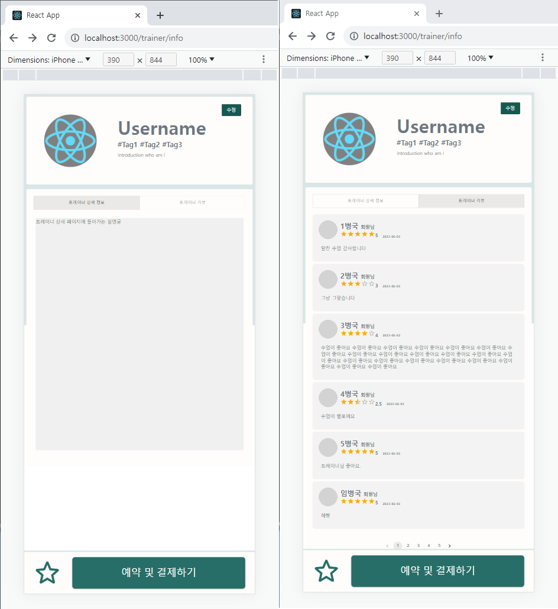
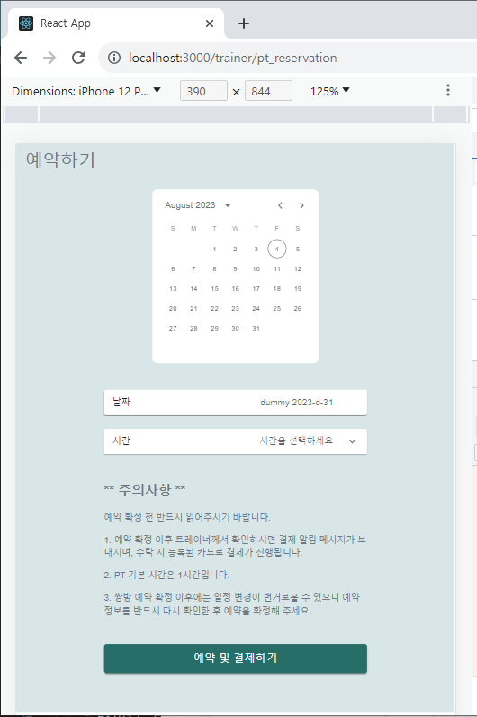
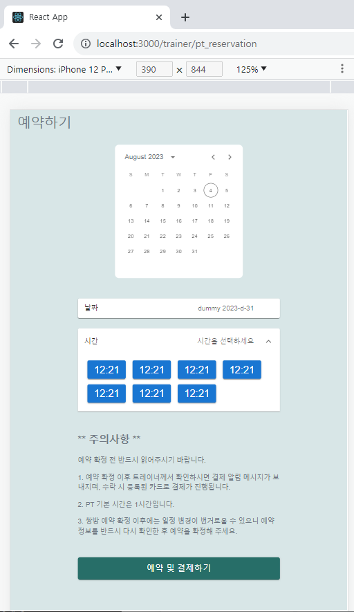

# [tcha] FE_YMY (230804)

## Today's Task

  ### 1. 아침 코드리뷰
  - Clean 
  ### 2. Trainer 페이지 작업 진행 
  - 레거시버전 레이아웃 완성
    - 트레이너 PT정보 페이지 *-> (100%)*
      - 하단바 구현
        - 즐겨찾기버튼 (on/off까지)
          - [mui icon - StarRounded](https://mui.com/material-ui/material-icons/?query=s&theme=Rounded)
        - 예약페이지로 이동 버튼
          - [mui icon - Button](https://mui.com/material-ui/react-button/#text-buttons)
    - 트레이너 리뷰모음 페이지 *-> (100%)*
    - 트레이너 회원관리 페이지 *-> (0%)*
    - 트레이너 스케줄 페이지  *-> (0%)*
  - API 연결 (Dummy Data) 기반 마련 
  ### 3. User 페이지 작업 진행
  - 레거시버전 레이아웃 완성
    - 유저 예약 페이지 *-> (90%)*
      - 네이버 예약시스템 reference 채용
      - 시간 선택방식 구현
        - [mui accordian](https://mui.com/material-ui/react-accordion/)
  - API 연결 (Dummy Data) 기반 마련 

  
  

## 회의록
  - **FE**
    - Display 관련 설정 - Desktop / Mobile 고려한 settings
      - 추후 다시 논의 
    - 화상 기술 OpenVidu 관련 회의 

   

  - **BE 소통**
    -  필요 API 수정 논의
       - (트레이너) PT 생성 페이지
       - (유저) PT 예약 페이지 
    

  <!-- - **지금까지 정리 및 추가된 Prototype 공유**  
     
     
     
      -->

  

## TIL 
### React 관련 
- [REACT & OPENVIDU](https://docs.openvidu.io/en/stable/tutorials/openvidu-react/)

### FE 관련
- [mui icon - StarRounded](https://mui.com/material-ui/material-icons/?query=s&theme=Rounded)
- [mui icon - Button](https://mui.com/material-ui/react-button/#text-buttons)
- [mui accordian](https://mui.com/material-ui/react-accordion/) 
  
<!-- ### BE 관련
  

    
 AWS 

  
  
 -->

  

## FE 진행상황  

### Trainer Detail Page
- Legacy ver Layout (100%)
-  하단 고정바 레이아웃 및 기능구현 (90%)
-  API, Axios, Dummy Data (80%)
    

### User Reservation Page
  - Legacy ver Layout (100%)
  -  API, Axios, Dummy Data (50%)
  
  

  