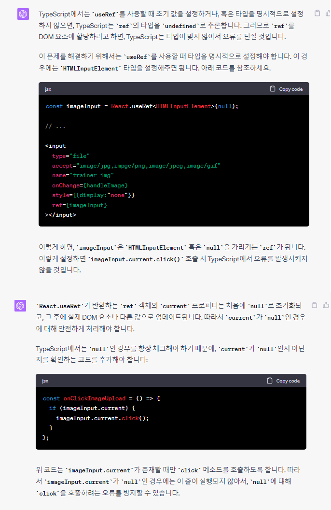
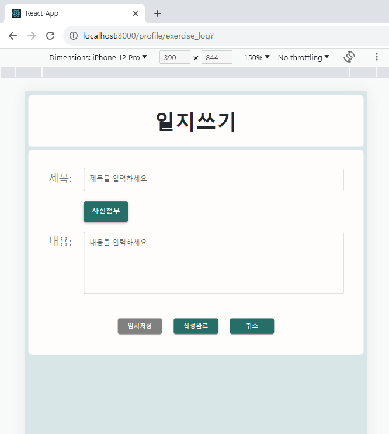
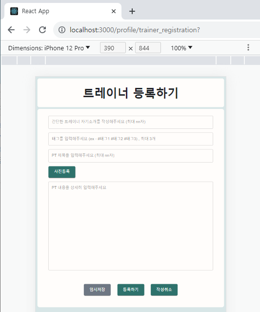
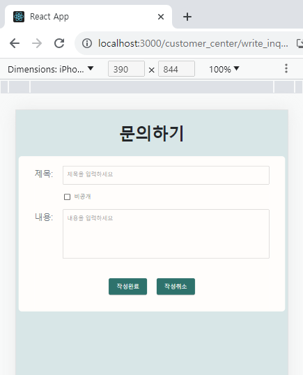
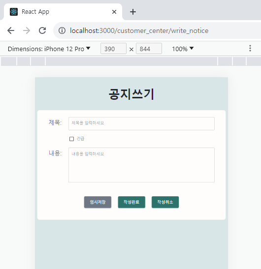

# [tcha] FE_YMY (230809-230810)

## Today's Task

  ### 1. 아침 코드리뷰
  - Clean 
  ### 2. Trainer 페이지 작업 진행 
  - 레거시버전 구현 진행
    - PT 생성 페이지[New]
      - 시간 선택 구현
        - [mui transfer list](https://mui.com/material-ui/react-transfer-list/)
        - 30분 단위의 선택버튼, 그러나 PT시간은 1시간 단위기 때문에 겹치는 시간이 발생
        - 특정 시간 선택 시 그 다음타임(30분 뒤)는 자동으로 선택불가로 바뀌며 리스트에서 삭제됨 
        - 선택된 시간은 오른쪽의 Timeline에서 시각적으로 확인 가능
          - [mui timeline](https://mui.com/material-ui/react-timeline/)
          - npm install @mui/lab @mui/material
    - 일지 작성 form *-> (85%)*
      - contents create 위한 "TEXT EDITOR" 연구 및 추가 중 
    - 회원 정보수정 페이지 *-> (0%)*
    - 회원관리 페이지 *-> (0%)*
    - 스케줄 페이지  *-> (0%)*
  <!-- - API 연결 (Dummy Data) 기반 마련  -->
  ### 3. User 페이지 작업 진행
  - 레거시버전 구현 진행
    - 트레이너 등록 페이지 *-> (100%)*
      - 레이아웃, API 연결 완료 
    - 일지 보기 form *-> (0%)*
    - 리뷰 등록 페이지 *-> (0%)*
  ### 4. 공지/QNA게시판 페이지 작업 진행
    - 레거시버전 구현 진행
      - 공지 글 작성 *-> (100%)*
        - 레이아웃, API 연결 완료
      - QNA 글 작성 *-> (100%)*
        - 레이아웃, API 연결 완료 
      - 공지/QNA 전체 조회 및 상세 조회 *-> (50%)*
        - API 연결 (80%)
        - 레이아웃 (5%)
  <!-- - API 연결 (Dummy Data) 기반 마련  -->
  ### 4. Global Settings 이슈 해결 
  - 반응형 Display에서 배경색이 전체로 적용되지 않고 잘리는 이슈  
      - 개발자 모드 기준 화면의 크기를 app으로 변경했을 때 세로길이가 길어져 contents 밖의 배경에 bgcolor가 적용되지 않았었음 
      - createGlobalStyle 이용하여 적용
      - 추가 테스트 필요 (회의록 참고)
  

  
  

## 회의록
  - **FE**
    - Display 관련 설정 - Desktop / Mobile 고려한 settings
      - [임시해결]상태
      - [테스트 필요] 
        - 실제 mobile 환경에서 실행시 반응형으로 크기 조정되어 render되는지 
        - 아니면 web크기 그대로 스크롤바가 생기는지 테스트 필요
      - 스터디 및 연구중 (TIL 참고)
    - 화상 기술 OpenVidu 관련 회의 
    - 추가된 npm install 목록 (timeline)
      - npm install @mui/lab @mui/material
   

  <!-- - **BE 소통**
    -  필요 API 수정 논의
       - (트레이너) PT 생성 페이지
       - (유저) PT 예약 페이지  -->
    

  <!-- - **지금까지 정리 및 추가된 Prototype 공유**  
     
     
     
      -->

  

## TIL 
### React 관련 
- [React.useRef 사용법](https://itprogramming119.tistory.com/entry/React-useRef-%EC%82%AC%EC%9A%A9%EB%B2%95-%EB%B0%8F-%EC%98%88%EC%A0%9C)
    
- [REACT & OPENVIDU](https://docs.openvidu.io/en/stable/tutorials/openvidu-react/)

### FE 관련
- 반응형 화면 setting 관련
  - [모바일 웹앱 100vh - 실제크기 issue (뷰포트 크기계산)](https://velog.io/@eunddodi/React-%EB%AA%A8%EB%B0%94%EC%9D%BC-%EC%9B%B9-%EC%95%B1-100vh-%EC%8B%A4%EC%A0%9C-%ED%99%94%EB%A9%B4-%ED%81%AC%EA%B8%B0%EB%A1%9C-%EB%A7%9E%EC%B6%94%EA%B8%B0)
  - [반응형 페이지 만들기 - react-responsive](https://stickode.tistory.com/643)
  - [반응형 웹](https://eblee-repo.tistory.com/47)
  
<!-- ### BE 관련
  

    
 AWS 

  
  
 -->

  

## FE 진행상황  

### [Trainer] Create_Exercise_Log Page
- Legacy ver Layout (100%)
- Form 및 사진첨부 기능구현 (90%)
- API, Axios, Dummy Data (85%)
    

### [User] Trainer_Register/Modify Page
  - Legacy ver Layout (100%)
   - Form 및 사진첨부 기능구현 (90%)
   - API, Axios, Dummy Data (85%)
    

### [user] Create_Inquiry Page
- Legacy ver Layout (100%)
- Form 및 사진첨부 기능구현 (90%)
- API, Axios, Dummy Data (85%)
    

### [Admin] Create_Notice Page
- Legacy ver Layout (100%)
- Form 및 사진첨부 기능구현 (90%)
- API, Axios, Dummy Data (85%)
    
  