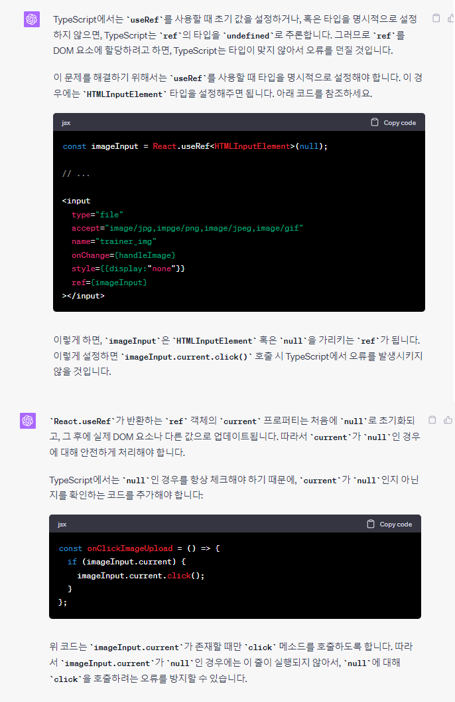
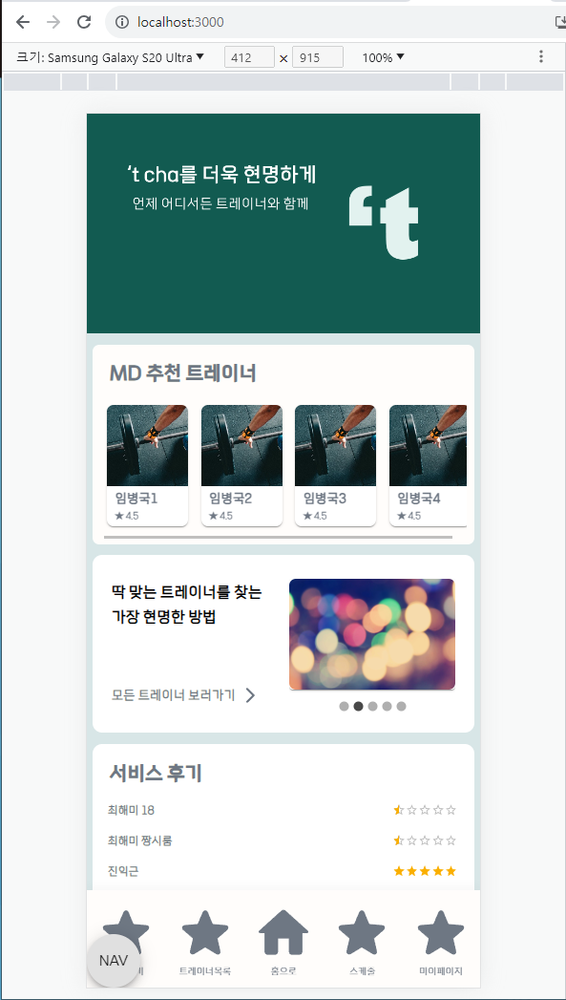
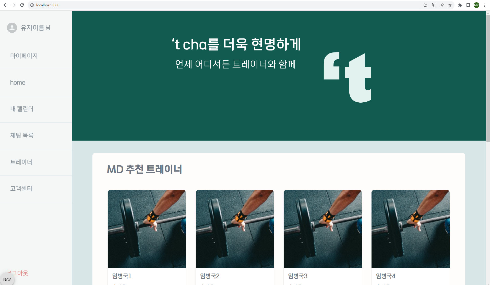
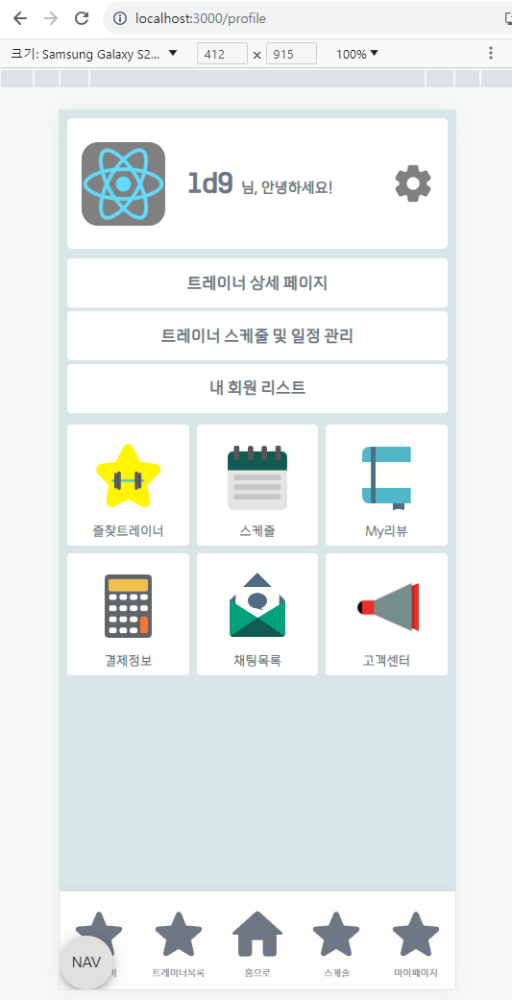
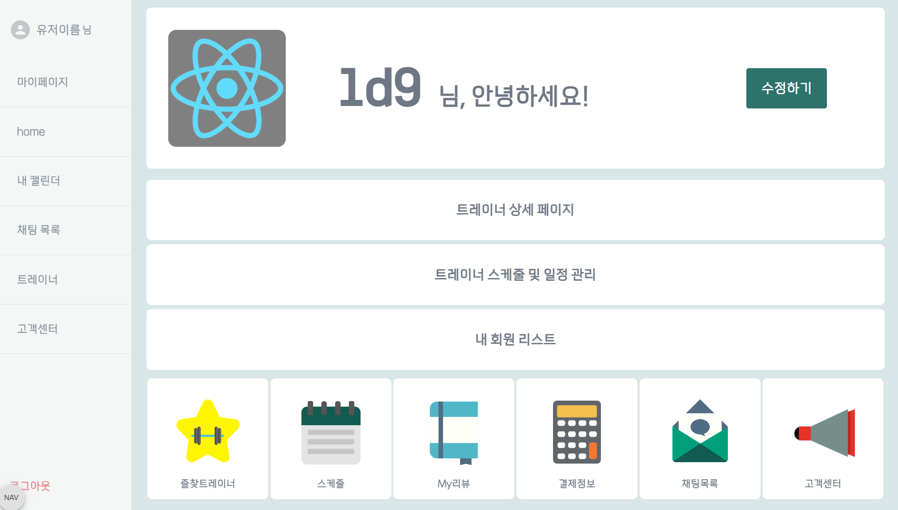
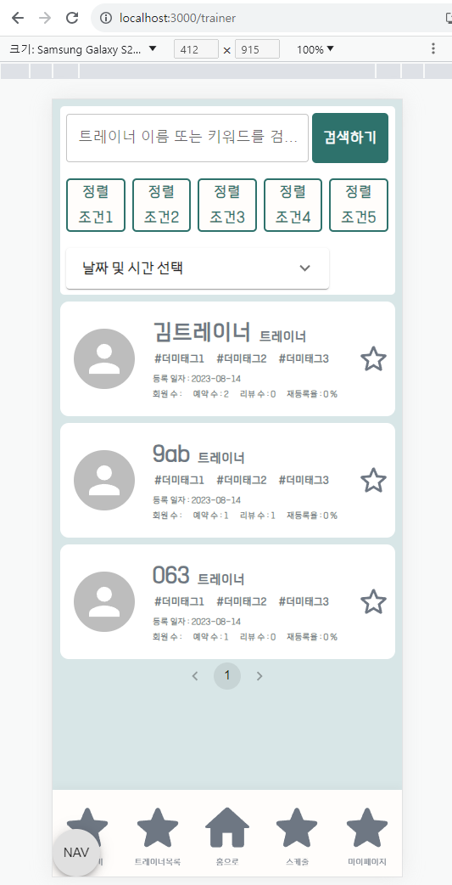
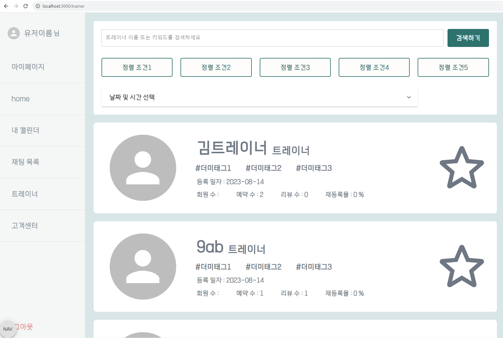
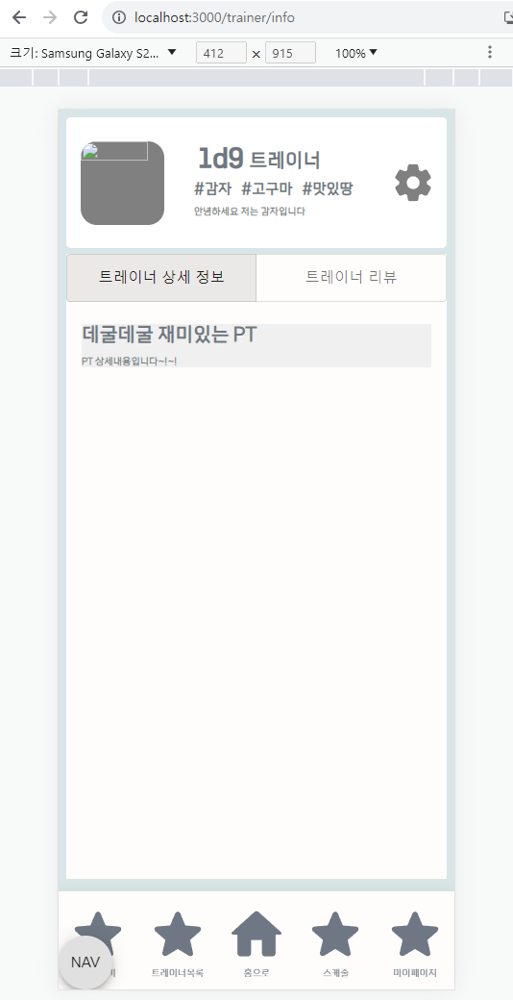
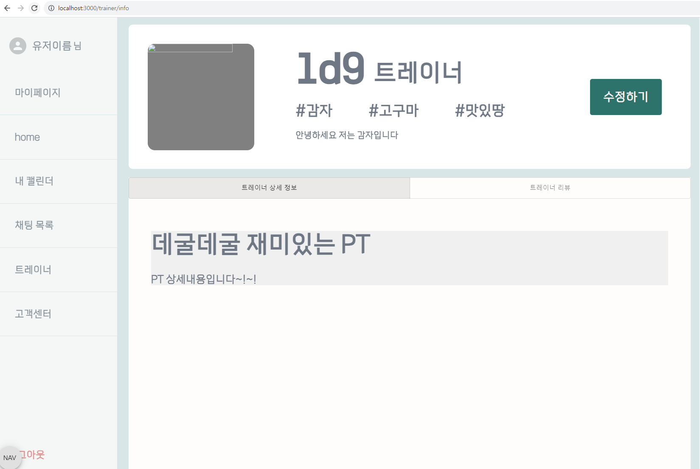

# [tcha] FE_YMY (230809-230814)

## Today's Task

  ### 1. 아침 코드리뷰
  - 모바일 하단바 적용 시 contents와 겹쳐보이는 현상 발견
    - 하단바 높이만큼 contents에 여백(padding) 추가 
  ### 2. 반응형 CSS 및 디자인 작업 진행  
  - 최종본 구현 진행 
    - Desktop 환경
      - 고정형 Sidebar를 탑재한 Webapp 형태
    - Mobile 환경
      - 고정형 Bottombar를 탑재한 App 형태

    - 메인페이지 *-> (100%)*
    - 마이페이지 *-> (100%)*
    - 트레이너 검색 *-> (100%)*
    - 트레이너 페이지 *-> (80%)*
    - 결제정보 페이지  *-> (50%)*
    - 고객센터 페이지  *-> (50%)*

  ### 4. Global Settings 이슈 해결 
  - 반응형 Display에서 배경색이 전체로 적용되지 않고 잘리는 이슈  
      - 개발자 모드 기준 화면의 크기를 app으로 변경했을 때 세로길이가 길어져 contents 밖의 배경에 bgcolor가 적용되지 않았었음 
      - createGlobalStyle 이용하여 적용했었음
 - min-height를 100vh로 설정하여 컨텐츠가 빠져나가는것을 막음 
  

  
  

## 회의록
  - **FE**
    - Display 관련 설정 - Desktop / Mobile 고려한 settings
      - [해결]
    - 화상 기술 OpenVidu 관련 회의 

   

  <!-- - **BE 소통**
    -  필요 API 수정 논의
       - (트레이너) PT 생성 페이지
       - (유저) PT 예약 페이지  -->
  

  

## TIL 
### React 관련 
- [React.useRef 사용법](https://itprogramming119.tistory.com/entry/React-useRef-%EC%82%AC%EC%9A%A9%EB%B2%95-%EB%B0%8F-%EC%98%88%EC%A0%9C)
    
- [REACT & OPENVIDU](https://docs.openvidu.io/en/stable/tutorials/openvidu-react/)

### FE 관련
- 반응형 화면 setting 관련
  - [모바일 웹앱 100vh - 실제크기 issue (뷰포트 크기계산)](https://velog.io/@eunddodi/React-%EB%AA%A8%EB%B0%94%EC%9D%BC-%EC%9B%B9-%EC%95%B1-100vh-%EC%8B%A4%EC%A0%9C-%ED%99%94%EB%A9%B4-%ED%81%AC%EA%B8%B0%EB%A1%9C-%EB%A7%9E%EC%B6%94%EA%B8%B0)
  - [반응형 페이지 만들기 - react-responsive](https://stickode.tistory.com/643)
  - [반응형 웹](https://eblee-repo.tistory.com/47)
  
<!-- ### BE 관련
  

    
 AWS 

  
  
 -->

  

## FE 진행상황  

### Main Page
- CSS & Design (100%)
    
    

### MyPage
- CSS & Design (100%)
    
    

### Trainers
- CSS & Design (100%)
    
    

### Trainer Detail
- CSS & Design (100%)
    
    

